# Đối chiếu 40 ảnh với menu hiện tại

Menu cập nhật ở commit `f6d560c` có mã món `1–34`; `20` và `30` có lựa chọn theo chữ A–G. Bảng dưới đây dùng đúng thứ tự ảnh và mã người dùng đã gửi. Ảnh được gắn theo **mã**, không xác nhận tên món qua ảnh gốc 72 × 72 px. Đặc biệt ảnh 1, 3 và 4 nhìn không giống tên món ở menu mới, nên cần khách kiểm tra trước khi coi đó là ảnh chính xác.

| Ảnh | Mã đã gửi | Vị trí trong menu mới | Kết quả |
|---|---|---|---|
| 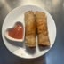 01 | 1 | 1 · Tom Kha | Đã gắn theo mã |
|  02 | 2 | 2 · Tom Yam | Đã gắn theo mã |
| 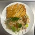 03 | 3 | 3 · Sauer-Scharf Suppe | Đã gắn theo mã |
|  04 | 7 | 7 · Avocado Salat | Đã gắn theo mã |
| 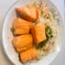 05 | 20b | 20 · Bún Trộn / B · Hähnchen | Đã gắn vào lựa chọn |
| 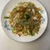 06 | 20f | 20 · Bún Trộn / F · Gebackene Ente | Đã gắn vào lựa chọn |
| 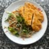 07 | 20j | — | Món 20 không có lựa chọn J |
| 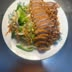 08 | 30a | 30 · Sen Wok / A · Tofu | Đã gắn vào lựa chọn |
| 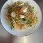 09 | 30b30d | 30 · Sen Wok / B · Hähnchen và D · Garnelen | Một ảnh dùng cho hai mã đã ghi liền |
| 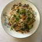 10 | 30e | 30 · Sen Wok / E · Gebackenes Hähnchen | Đã gắn vào lựa chọn |
| 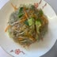 11 | 30f | 30 · Sen Wok / F · Gebackene Ente | Đã gắn vào lựa chọn |
| 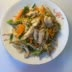 12 | 30i | — | Món 30 không có lựa chọn I |
| 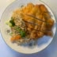 13 | 40a | — | Không có món 40 |
| 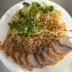 14 | 40b | — | Không có món 40 |
| 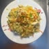 15 | 40d | — | Không có món 40 |
| 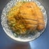 16 | 50a | — | Không có món 50 |
| 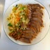 17 | 50b | — | Không có món 50 |
| 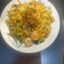 18 | 50d | — | Không có món 50 |
| 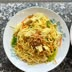 19 | 50e | — | Không có món 50 |
| 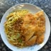 20 | 60a | — | Không có món 60 |
| 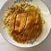 21 | 60b | — | Không có món 60 |
| 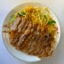 22 | 60b | — | Mã trùng ảnh 21 |
| 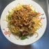 23 | 60d | — | Không có món 60 |
| 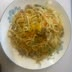 24 | 60g | — | Không có món 60 |
| 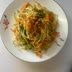 25 | 60f | — | Không có món 60 |
| 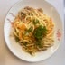 26 | 60i | — | Không có món 60 |
| 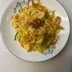 27 | 70f | — | Không có món 70 |
| 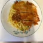 28 | 70e | — | Không có món 70 |
| 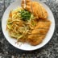 29 | 70b | — | Không có món 70 |
| 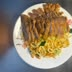 30 | 70b | — | Mã trùng ảnh 29 |
| 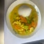 31 | 70d | — | Không có món 70 |
| 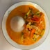 32 | 85a | — | Không có món 85 |
| 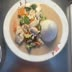 33 | 86a | — | Không có món 86 |
| 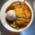 34 | 81a | — | Không có món 81 |
| 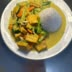 35 | 84b | — | Không có món 84 |
| 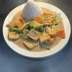 36 | 85h81h | — | Không có món 85 hoặc 81 |
| 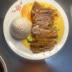 37 | 80d | — | Không có món 80 |
| 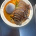 38 | 86d | — | Không có món 86 |
| 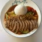 39 | 84d | — | Không có món 84 |
| 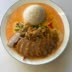 40 | 86d | — | Mã trùng ảnh 38 |

Kết quả: 10 ảnh khác nhau được gắn vào 11 mã món/lựa chọn; 30 ảnh chưa có vị trí tương ứng trong menu hiện tại (trong đó 3 ảnh trùng mã).
