# 40 ảnh món ăn — menu khách gửi ngày 30/09/2026

Hai ảnh chụp menu mới có các món 1–10, 20/30/40/50/60/70 (lựa chọn a–j) và các loại sốt wok 80/81/83/84/85/86/87/88 (lựa chọn a–j). Gắn ảnh theo **mã người dùng đã đánh dấu**, không tự đổi mã theo suy đoán thị giác. Mỗi biến thể có ảnh riêng trong dòng giá và cửa sổ chọn món; món cha không dùng ảnh của một biến thể làm ảnh đại diện.

| Ảnh | Mã đánh dấu | Món trong menu mới | Kết quả |
|---|---|---|---|
|  01 | 1 | Vietnam-Frühlingsrollen | Đã gắn |
| 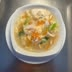 02 | 2 | Mini Frühlingsrollen | Đã gắn theo mã; ảnh nhìn giống súp, cần khách xác nhận |
| 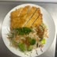 03 | 3 | Wantan gebacken | Đã gắn |
|  04 | 7 | Hühner-Garnelen-Entensuppe | Đã gắn theo mã; ảnh nhìn giống món mì, cần khách xác nhận |
| 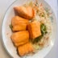 05 | 20b | Pho Xao · Knusprige Hähnchenbrust | Đã gắn theo mã; ảnh nhìn giống chả giò, cần khách xác nhận |
| 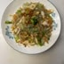 06 | 20f | Pho Xao · Rindfleisch | Đã gắn |
| 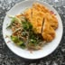 07 | 20j | Pho Xao · Gebackener Lachs | Đã gắn theo mã; ảnh nhìn không rõ cá hồi, cần khách xác nhận |
| 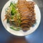 08 | 30a | Mi Xao · Hühnerfleisch | Đã gắn |
| 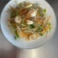 09 | 30b30d | Mi Xao · Knusprige Hähnchenbrust / Ente | Một ảnh cho hai mã đã ghi liền |
| 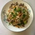 10 | 30e | Mi Xao · Garnelen | Đã gắn theo mã |
| 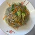 11 | 30f | Mi Xao · Rindfleisch | Đã gắn |
| 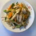 12 | 30i | Mi Xao · Vegetarisch | Đã gắn |
| 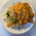 13 | 40a | Mi Tom Xao · Hühnerfleisch | Đã gắn |
|  14 | 40b | Mi Tom Xao · Knusprige Hähnchenbrust | Đã gắn |
|  15 | 40d | Mi Tom Xao · Ente | Đã gắn |
|  16 | 50a | Com Rang · Hühnerfleisch | Đã gắn |
| 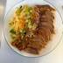 17 | 50b | Com Rang · Knusprige Hähnchenbrust | Đã gắn |
| 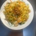 18 | 50d | Com Rang · Ente | Đã gắn |
| 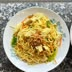 19 | 50e | Com Rang · Garnelen | Đã gắn |
| 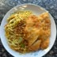 20 | 60a | My Xao · Hühnerfleisch | Đã gắn |
| 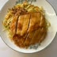 21 | 60b | My Xao · Knusprige Hähnchenbrust | Đã gắn; dùng ảnh này thay vì ảnh 22 trùng mã |
| 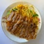 22 | 60b | My Xao · Knusprige Hähnchenbrust | Trùng mã, không gắn |
| 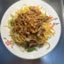 23 | 60d | My Xao · Ente | Đã gắn |
| 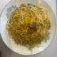 24 | 60g | My Xao · Schweinefleisch | Đã gắn |
| 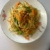 25 | 60f | My Xao · Rindfleisch | Đã gắn |
|  26 | 60i | My Xao · Vegetarisch | Đã gắn |
| 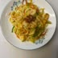 27 | 70f | Udon · Rindfleisch | Đã gắn |
| 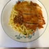 28 | 70e | Udon · Garnelen | Đã gắn |
| 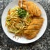 29 | 70b | Udon · Knusprige Hähnchenbrust | Đã gắn; dùng ảnh này thay vì ảnh 30 trùng mã |
| 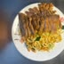 30 | 70b | Udon · Knusprige Hähnchenbrust | Trùng mã, không gắn |
| 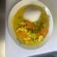 31 | 70d | Udon · Ente | Đã gắn |
| 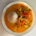 32 | 85a | Gelb-Curry · Hühnerfleisch | Đã gắn |
| 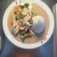 33 | 86a | Rot-Curry · Hühnerfleisch | Đã gắn |
| 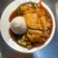 34 | 81a | Erdnuss-Sauce · Hühnerfleisch | Đã gắn |
| 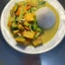 35 | 84b | Hoisin-Sauce · Knusprige Hähnchenbrust | Đã gắn |
| 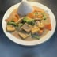 36 | 85h81h | Gelb-Curry / Erdnuss-Sauce · Tofu | Một ảnh cho hai mã đã ghi liền |
| 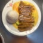 37 | 80d | Mango-Sauce · Ente | Đã gắn |
|  38 | 86d | Rot-Curry · Ente | Trùng mã, không gắn; ảnh 40 nhìn giống cà-ri đỏ hơn |
| 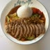 39 | 84d | Hoisin-Sauce · Ente | Đã gắn |
| 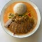 40 | 86d | Rot-Curry · Ente | Đã gắn; chọn ảnh này cho mã trùng |

**Tổng:** 39 vị trí ảnh trên web, dùng 37 ảnh khác nhau. Ba ảnh 22/30/38 không gắn vì trùng mã. Mã 30b30d và 85h81h được hiểu là một ảnh dùng ở hai vị trí. Các ảnh 02/04/05/07 có dấu hiệu không khớp tên món theo mắt nhìn, nhưng vẫn giữ đúng mã người dùng cung cấp để khách kiểm tra.

**Đọc chữ mờ:** 3 được hiểu là “Wantan gebacken” (món chiên, thay vì “gehacken”); giá 30c/40c/60c và các nhóm tương tự đọc là 10,00 € theo dòng 20c và bảng giá lặp lại; món 8 giữ nguyên danh sách Huhn/Garnelen/Ente mà chưa tự tạo các biến thể mới.
